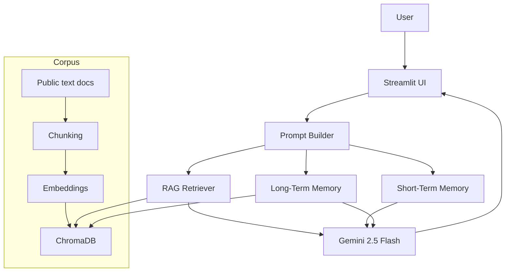

# Architecture

## Flow

1. The user asks a question in Streamlit.
2. The app retrieves relevant document chunks from ChromaDB.
3. The app retrieves relevant durable memories for the same user.
4. The app builds a persona-rich prompt.
5. Gemini generates the response.
6. New durable memories are extracted and stored.
